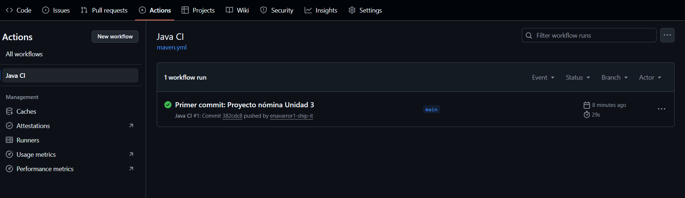

# Clínica Salvador(sistema de nomina) - Actividad de la Unidad 3 - Igenieria de Software

Este repositorio contiene una implementación  para la actividad de la Unidad 3 de Ingeniería de Software: un sistema de cálculo de nómina y manejo de empleados, aplicando principios SOLID, código limpio, refactorización, pruebas unitarias y CI

## Estructura
- `src/main/java` - código fuente
- `src/test/java` - pruebas unitarias (JUnit 5)
- `.github/workflows/maven.yml` - Workflow de integración continua (CI) para ejecutar `mvn test` automáticamente
## Requisitos
- JDK 25
- Maven 3.8+
- Git (para control de versiones)  
- Visual Studio Code para edición de código

## Cómo ejecutar tests
```bash
mvn test
```

## Supuestos
- Las tasas de deducción (seguridad social y pensión) se representan como 4% por defecto.
- Bono de alimentación se añade como ejemplo para empleados permanentes.
- ARL y reglas específicas son configurables en la clase `Config`.

## Buenas prácticas incluidas
- Principios SOLID (clases por responsabilidad, uso de interfaces, inyección de dependencias simple).
- Código limpio y comentarios explicativos.
- Pruebas unitarias que cubren casos principales.

## Resultados de pruebas
Se ejecutaron las pruebas unitarias con:

```bash
mvn test

---

## Evidencia de ejecución (CI)

Este proyecto cuenta con integración continua configurada en GitHub Actions,  
donde se ejecutan automáticamente las pruebas unitarias con Maven cada vez que se hace un push.



Puedes ver la ejecución directamente aquí:  
[Ver en GitHub Actions](https://github.com/enavarror1-ship-it/clinica-salvador-payroll/actions)

---

## Repositorio del proyecto

Puedes acceder al código completo aquí:  
[https://github.com/enavarror1-ship-it/clinica-salvador-payroll](https://github.com/enavarror1-ship-it/clinica-salvador-payroll)


#Salida relevante de la ejecución
[INFO] Results:
[INFO]
[INFO] Tests run: 7, Failures: 0, Errors: 0, Skipped: 0
[INFO]
[INFO] BUILD SUCCESS


